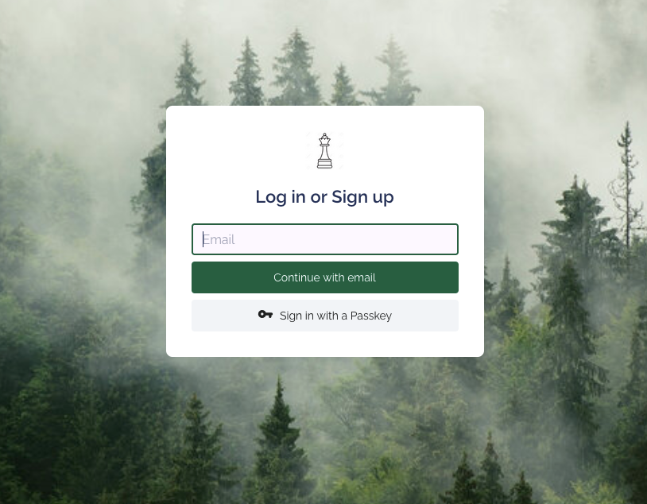
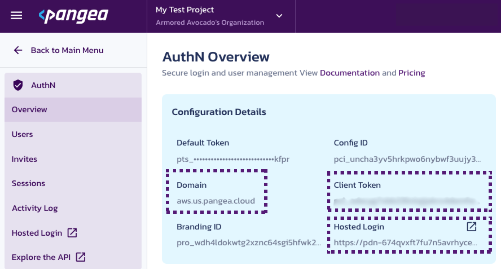
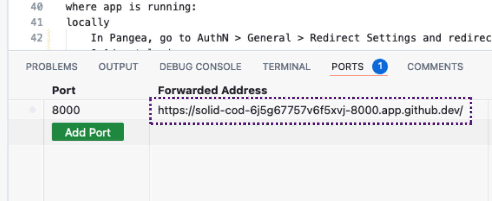
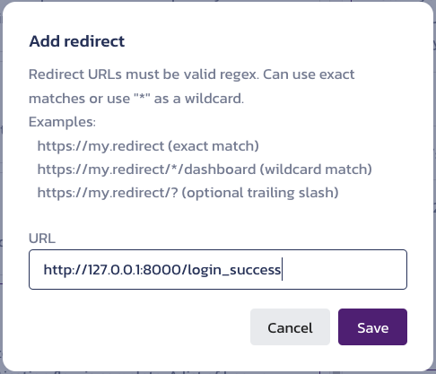
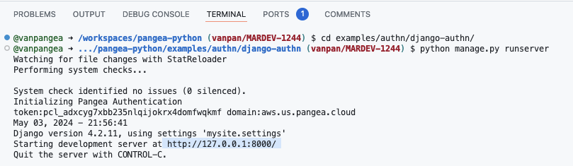

# Pangea Django Example
## Overview
This app demonstrates how to use the Pangea AuthN Django middleware in an application.  



## Pre Reqs Check
In order to run this application you are going to need:
 - [Pangea.cloud](https://pangea.cloud/) Account with AuhtN service enabled
 - Github account

There are two ways we will cover on how to run this example app: Codespace or locally. 

## Getting Started via Codespace
1. Git clone this repo

> Note: You can also open this repo in a Codespace

2. Open a terminal in the directory and make sure the dependancies are installed with the commands below 

```bash
python -m pip install Django
pip install python-dotenv
pip install pangea-django
```

3. Rename `.env.example` into `.env`
<br>
<br>

4. Fill out the tokens & values found in .env with the values found in the Pangea AuthN Overview page



<br>
<br>

5. Copy the local address. It is probably https://127.0.0.1:8000

>Note: Copy the Forwarded Address from the Ports Section of the terminal in the Codespace


<br>
<br>


6. In Pangea go to `AuthN > General > Redirect` Settings and redirect to the copied local address and add `/login_success` to the end. Make sure to hit save.



<br>
<br>

7. Go back to the Codespace and run the migrate command shown below.
```bash
python manage.py migrate
```
<br>

8. Finally, run the command below to  
```bash
python manage.py runserver
```
<br>

9. Head on over the address shown in your terminal to see your Authentication Page




